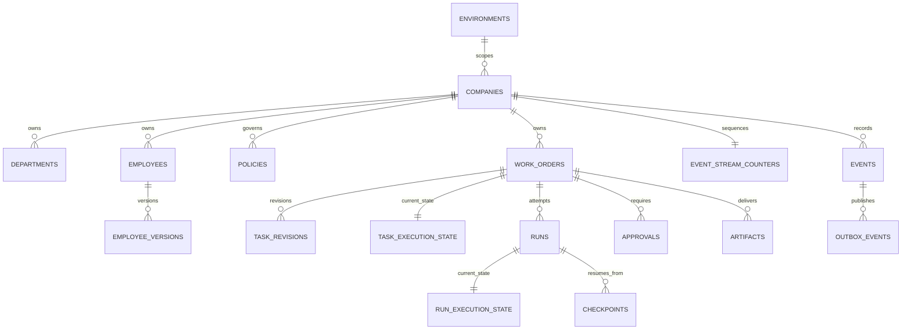

# Bằng chứng Phase 03 — Dữ liệu và bằng chứng bền vững

Ngày bàn giao: 08/10/2026 · Trạng thái hiện tại: **Hoàn tất theo nghiệm thu của Chủ tịch ngày 08/10/2026 (“ok duyệt”)** · Inference grant: **0**.

## Dependency và kiểm tra trước khi làm

- Phase 00 đặc tả/baseline đã được nghiệm thu; Phase 01 runtime đã được nghiệm thu.
- Phase 02 đã được tiếp nhận làm dependency theo chỉ thị trực tiếp của Chủ tịch để triển khai Phase 03. Giới hạn viewport 390 px của Phase 02 vẫn chưa được xác minh trực tiếp và được giữ lại trong [evidence Phase 02](phase-02.md).
- Trước khi sửa: PostgreSQL container healthy; API `/api/v1/health/ready` trả `database: ok`; web loopback trả HTTP 200; Dev Hub discovery cho block `15500–15599` không có conflict/warning. codex-server không được gọi.
- Không có inference grant/test batch. Không gọi model, chat/session hay codex-server.

## Mô hình dữ liệu được thêm



Migration `20261008_0002` thêm 17 bảng: `environments`, `companies`, `departments`, `employees`, `employee_versions`, `policies`, `work_orders`, `task_revisions`, `task_execution_state`, `runs`, `run_execution_state`, `checkpoints`, `approvals`, `artifacts`, `event_stream_counters`, `events`, `outbox_events`. Ràng buộc composite key/FK gắn environment và company, check constraints cho state/lifecycle, khóa version và sequence, unique dedup key, chỉ mục theo truy vấn trạng thái/task/run/event và partial index cho pending approvals/outbox.

`agent_corporation_app` là login role riêng, `NOSUPERUSER`, `NOBYPASSRLS`; grant DML theo nhu cầu và `FORCE ROW LEVEL SECURITY` với scope lấy từ `app.environment_id`/`app.company_id`. Alembic chạy bằng URL migration admin tách biệt. `.env` local đã được chuyển sang app/migration URL riêng và giữ mode `0600`; không ghi secret vào repository hoặc evidence.

## Command/event contract

- Tạo Work Order ghi `work_orders` + revision 1 + execution state `draft` + event `TASK_CREATED` + outbox trong cùng transaction. Event không chứa raw goal; lưu SHA-256 `goal_ref` và số tiêu chí.
- Chuyển state khóa row và kiểm tra `expected_version` cùng đồ thị transition; cập nhật state, event `TASK_STATE_CHANGED` và outbox cùng transaction. Invalid/stale transition bị từ chối.
- Company-scoped sequence được lock tuần tự; `dedup_key` unique trong stream. Event và task payload được lọc secret-field, password/token/Bearer trước khi lưu.
- Product Spec V1 event catalog đã bổ sung `TASK_STATE_CHANGED` và HTML được sinh từ Markdown.
- Work command hiện là domain service nội bộ; chưa có public write endpoint, outbox worker, SSE/replay UI, company demo, auth/session hay artifact file store. Không tạo fixture còn tồn tại sau test.

## Dark mode và hostname local

- Nút chuyển giao diện sáng/tối có `aria-label`/`aria-pressed`, lưu `agent-corporation.theme` trong localStorage và dùng `prefers-color-scheme` khi chưa có lựa chọn. Script trong HTML áp theme trước render để tránh chớp màu; meta theme-color đồng bộ khi đổi.
- Dev Hub registry bật route `agent-corporation.localhost` → web `127.0.0.1:15500`; Vite chỉ allow hostname này. Caddy container đã được cấu hình publish **IPv4 loopback only** `127.0.0.1:80:80`; các Caddy route managed/manual có sẵn được giữ nguyên.
- IPv4: `agent-corporation.localhost` web **HTTP 200**, API readiness qua `/api/v1/health/ready` **HTTP 200**, route Dev Hub cũ `dev.localhost` **HTTP 200**. Hostname mặc định phân giải và kết nối `127.0.0.1`.
- IPv6: Docker daemon từ chối `[::1]:80:80` với lỗi port-forward expose status 500; publication không được cấu hình lại thành wildcard. Route IPv6 chưa hoạt động; đây là giới hạn môi trường hiện tại.
- Dev Hub `Caddyfile`, registry và tài liệu có thay đổi trước đó do người dùng; generator chỉ ghi managed routes, giữ nguyên các route manual hiện hữu. Dev Hub Markdown/HTML đã được đồng bộ.

## Kiểm tra và kết quả

```text
PostgreSQL health (trước khi bắt đầu)             PASS
Alembic current                                  PASS — 20261008_0002 (head)
App database role                                PASS — current_user=agent_corporation_app, rolsuper=false, rolbypassrls=false
GET /api/v1/health/ready sau restart API          PASS — database=ok
API tests                                         PASS — 8/8 PostgreSQL integration tests
Web lint/build                                    PASS — Node 24.21.0; oxlint + tsc + Vite production build
Dev Hub Caddy validation                         PASS
Dev Hub Compose config                           PASS
Dev Hub check/test/build                          PASS — TypeScript check; 8/8 tests; tsc build (Node 24.21.0)
Proxy IPv4 web/API/existing route                PASS — HTTP 200
Proxy IPv6 publication                           BLOCKED — Docker expose error 500; bind không được mở rộng
Phase 00 docs validation + Markdown/HTML sync    PASS — 31 events; deterministic HTML/links/anchors/IDs/lang/favicon/JS syntax
git diff --check                                 PASS — không có whitespace errors trong repo Agent Corporation
```

Các lệnh sản phẩm chính: `uv run --project apps/api pytest apps/api/tests -q`; `npm run lint` và `npm run build` trong `apps/web` bằng Node 24.21.0; tại Dev Hub chạy `npm run check`, `npm test`, `npm run build`, `npm run docs`, `npm run discover`, `.local/caddy validate --config Caddyfile` và `docker compose -f compose.proxy.yml config --quiet`. Tất cả kiểm tra nêu PASS ở trên đều đã thực thi; riêng IPv6 là giới hạn runtime đã ghi rõ.

## Kết quả và giới hạn nghiệm thu

- Persistence qua kết nối DB engine mới, state/event atomicity, RLS chặn company/environment khác, dedup, redaction, invalid transition và rollback được xác minh bằng PostgreSQL integration tests; migration đã áp dụng và API process được restart bằng app role hạn chế.
- Tests dùng scope/company tạm và dọn dữ liệu sau lượt chạy; không có demo company/task seed còn lại.
- Không mở endpoint ghi chưa có authentication; Phase 03 hoàn thành data/domain boundary, không thực thi agent/runtime. Persistence được kiểm tra qua engine mới, chưa có write endpoint để xác minh task qua HTTP sau API restart. Không kiểm tra inference hoặc codex-server.
- Dark mode được kiểm bằng source/build; chưa có browser screenshot xác nhận tương phản/interaction. IPv6 Dev Hub chưa hoạt động do giới hạn Docker host.
- Tại thời điểm bàn giao ban đầu, Phase 03 chưa được nghiệm thu và Phase 04 chưa triển khai. Sau đó Chủ tịch xác nhận “ok duyệt” trước khi giao Phase 04; trạng thái master-plan được cập nhật. Không có inference grant.
